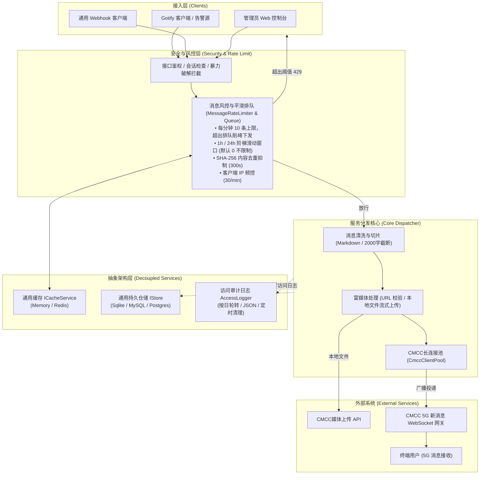

# CMCC New Message Webhook

面向[CMCC 5G 新消息](https://f.10086.cn/s/#hjeOlR)（OpenClaw 兼容通道）的高性能消息推送网关，支持 Gotify 协议兼容与通用 Webhook 接入。具备生产级消息防轰炸风控体系、解耦可拔插架构（通用缓存与仓储持久层）、现代化 Web 管理控制台、上游通道实时验活广播分发、AES-256-GCM 敏感数据落盘加密与审计日志按日轮转。

---

## 核心特性

- **双接入协议**：
  - **Gotify 协议兼容**：原生兼容 `POST /message?token=<token>`，无缝替代 Gotify 作为监控警报推送源。
  - **标准 Webhook 接入**：支持 `POST /webhook`（Bearer Secret 鉴权），提供标准化 JSON 消息载荷。
- **消息频控与平滑排队体系**：
  - **速率限制与削峰排队**：限制每分钟最多发送 10 条消息，超出配额自动进入异步 FIFO 队列平滑下发，防止上游过载与丢信。
  - **小时与自然日防护**：支持按需开启 1 小时发信上限（默认 0 不限制）与 24 小时自然日上限（默认 0 不限制）。
  - **内容智能防重放抑制**：基于 `SHA-256(content)` 计算消息指纹，在抑制窗口内（默认 300s）阻止相同内容重复刷屏。
  - **客户端 IP 速率限制**：支持客户端 IP 分钟级并发限流（默认 30 次/分）。
  - **规范化 429 响应**：触发恶意刷屏或 IP 频控时严格遵循 HTTP 规范返回 `429 Too Many Requests`，并在响应头携带 `Retry-After: <秒数>`。
  - **安全预警联动**：触发风控或异常拦截时，自动向上游指定或所有可用通道推送安全告警消息。
- **解耦与通用扩展架构**：
  - **通用缓存层抽象 (`ICacheService`)**：规范化缓存契约，默认内置零依赖的高精度毫秒级时间戳滑动窗口 `MemoryCacheService`，预留平滑无缝切换至 Redis 分布式缓存能力。
  - **通用持久层抽象 (`IStore`)**：采用仓储设计模式解耦数据库引擎，封装原生 `SqliteStore` 并预留通用工厂方法，为平滑切换 PostgreSQL / MySQL 提供统一标准。
- **完善的消息格式与富媒体支持**：
  - **纯文本**：Markdown 格式智能清洗与段落转换，长文本按 2000 字符结合段落语义自动切片。
  - **富媒体**：支持 `IMAGE`、`AUDIO`、`VIDEO`、`FILE`、`TEXT` 5 种媒体类型。
  - **媒体说明文字保真**：带说明文字的富媒体自动拆分为“独立文本消息 + 媒体消息”，防止终端接收时忽略文案。
  - **双通道媒体提交**：支持远程媒体 URL 解析，或在后台/接口直接上传最大 200MB 的本地媒体文件（自动流式上传至 CMCC 文件网关）。
- **多上游通道与广播分发**：
  - 支持配置多个CMCC通道（API Key，如 `ak_...`）。
  - 新增通道时执行真实 WebSocket `auth` 握手校验，未通过鉴权严禁保存。
  - 一个接口凭据可绑定多个上游通道，接收到通知后并行广播推送。
- **生产级安全防护与访问审计**：
  - **数据落盘加密**：上游 API Key 与接口密钥均经 AES-256-GCM 加密后存入数据库，前台仅展示脱敏预览。
  - **防暴力破解**：管理员登录 15 分钟内连续失败 5 次，自动封禁该 IP 30 分钟（HTTP 429）。
  - **SSRF 防御**：严格拦截针对内网、私有 IP 及 Localhost 的恶意远程媒体请求。
  - **访问审计日志**：请求 IP、路由、脱敏密钥、状态码及耗时全记录；支持纯文本与 JSON 双格式切换、按日自动切分及过期定时清理。
- **开箱即用的现代化可视化控制台**：
  - 仪表盘统计（已验证通道数、凭据数、实时投递成功/失败统计）。
  - 上游通道与接口凭据生命周期管理（创建、多选绑定、单次明文复制、删除）。
  - 手动推送测试（支持纯文本、富媒体 URL、本地文件上传直推）。
  - 投递历史明细追踪（状态、通道、摘要、MessageId、失败原因）。
  - 系统与风控可视化配置（图形化调整风控阈值、告警策略与日志保留期，即时热更新并同步至 `.env`）。

---

## 系统架构



---

## 快速开始

### 环境要求

- Node.js >= 22.0.0（内置原生 `node:sqlite` 支持）
- npm >= 10.0.0

### 方式一：本地部署

1. **安装依赖与配置环境**：
   ```bash
   npm install
   cp .env.example .env
   # Windows PowerShell: Copy-Item .env.example .env
   ```
2. **编辑 `.env` 文件**（设置管理员账号及加密密钥）：
   ```env
   ADMIN_USERNAME=admin
   ADMIN_PASSWORD=your-secure-password
   CONFIG_ENCRYPTION_KEY=your-random-32-chars-key
   ```
3. **编译并启动服务**：
   ```bash
   # 编译 TypeScript
   npm run build

   # 生产启动
   npm start

   # 或开发调试模式
   npm run dev
   ```

### 方式二：Docker 容器化部署

#### 1. 使用 Docker Compose（推荐）

```bash
# 启动服务
docker compose up -d

# 查看运行状态与日志
docker compose logs -f
```

#### 2. 直接使用 Docker 运行

```bash
# 构建镜像
docker build -t cmcc-newmsg-webhook .

# 启动容器并挂载数据卷
docker run -d \
  --name cmcc-webhook \
  -p 3000:3000 \
  -v $(pwd)/data:/app/data \
  -v $(pwd)/logs:/app/logs \
  --env-file .env \
  --restart unless-stopped \
  cmcc-newmsg-webhook
```

启动成功后，在浏览器访问 `http://localhost:3000/` 登录管理控制台。

---

## 环境变量配置

所有配置项均可在 `.env` 中声明，系统启动时会自动同步，亦可在后台“系统设置”页面进行可视化修改并双向热更新保存回 `.env`。

| 环境变量名 | 必填 | 默认值 | 说明 |
| :--- | :---: | :--- | :--- |
| **基础与安全配置** | | | |
| `ADMIN_USERNAME` | **是** | - | 管理后台登录用户名 |
| `ADMIN_PASSWORD` | **是** | - | 管理后台登录密码 |
| `CONFIG_ENCRYPTION_KEY` | **是** | - | 用于 AES-256-GCM 加密存储凭据密钥的随机字符串（丢失无法解密） |
| `PORT` | 否 | `3000` | HTTP 服务监听端口 |
| `HOST` | 否 | `0.0.0.0` | HTTP 服务监听地址 |
| `TRUST_PROXY` | 否 | `false` | 部署在 Nginx/Caddy 等反代之后时设为 `true`，以透传真实客户端 IP 供 Fail2ban 识别 |
| `ADMIN_COOKIE_SECURE` | 否 | `false` | 启用 HTTPS 生产代理时设为 `true` |
| `CMCC_DATABASE_PATH` | 否 | `./data/cmcc-webhook.sqlite` | SQLite 数据库文件存储路径 |
| **CMCC 网关配置** | | | |
| `CMCC_WS_URL` | 否 | `wss://5gvas01.cmicmaap.com/gtw-ai/openclaw/ws/msg` | CMCC 新消息 WebSocket 网关地址 |
| `CMCC_WS_VERSION` | 否 | `2.0` | CMCC 新消息协议版本 |
| `CMCC_SEND_TIMEOUT_MS` | 否 | `10000` | 消息投递超时时间（毫秒，1000~120000） |
| `CMCC_UPLOAD_URL` | 否 | `https://5gvas01.cmicmaap.com/gtw-ai/openclaw/api` | CMCC媒体文件上传 API 网关基地址 |
| `CMCC_UPLOAD_TIMEOUT_MS` | 否 | `120000` | 媒体文件上传超时时间（毫秒，1000~600000） |
| **暴力破解与安全审计** | | | |
| `ADMIN_LOGIN_FAIL_LIMIT` | 否 | `5` | 登录触发封禁的最大连续失败尝试次数 |
| `ADMIN_LOGIN_FAIL_WINDOW_MIN` | 否 | `15` | 登录失败统计观测窗口（分钟） |
| `ADMIN_LOGIN_BAN_DURATION_MIN` | 否 | `30` | 登录封禁限制时长（分钟） |
| `ACCESS_LOG_PATH` | 否 | `./logs/access.log` | 访问审计日志输出基准路径（自动按日轮转为单行 JSON 格式） |
| `ACCESS_LOG_RETENTION_DAYS`| 否 | `30` | 访问日志保留天数（系统定时每日清理过期文件） |
| **安全预警通知策略** | | | |
| `NOTIFY_ON_LOGIN` | 否 | `false` | 管理员登录成功时是否推送通知 |
| `NOTIFY_ON_LOGIN_FAILED` | 否 | `false` | 达到失败阈值或触发封禁时是否推送告警 |
| `NOTIFY_ON_AUTH_FAILED` | 否 | `false` | 接口鉴权失败次数达到阈值时是否推送告警 |
| `NOTIFY_UPSTREAM_ID` | 否 | `0` | 安全通知专用上游通道 ID（`0` 代表向全部可用通道广播） |
| `NOTIFY_LOGIN_FAIL_THRESHOLD`| 否 | `3` | 连续登录失败触发告警的阈值次数 |
| `NOTIFY_AUTH_FAIL_THRESHOLD` | 否 | `3` | 未授权访问触发告警的拦截次数阈值 |
| `NOTIFY_AUTH_FAIL_WINDOW_MIN`| 否 | `1` | 未授权访问告警统计时间窗口（分钟） |
| **消息防轰炸与流量风控** | | | |
| `RATE_LIMIT_MSG_MIN_MAX` | 否 | `10` | 每分钟发信上限（超出进入排队平滑下发） |
| `RATE_LIMIT_MSG_MIN_INTERVAL_SEC` | 否 | `0` | 发信最小间隔（秒，设为 0 关闭此项校验） |
| `RATE_LIMIT_MSG_HOUR_MAX` | 否 | `0` | 1 小时滑动窗口发信上限（0 为不限制） |
| `RATE_LIMIT_MSG_DAY_MAX` | 否 | `0` | 24 小时自然日滑动窗口发信上限（0 为不限制） |
| `RATE_LIMIT_IP_MIN_MAX` | 否 | `30` | 单个客户端 IP 每分钟请求上限 |
| `RATE_LIMIT_DUPLICATE_WINDOW_SEC` | 否 | `300` | 相同内容去重防重复重放抑制窗口（秒） |
| `NOTIFY_ON_RATE_LIMIT` | 否 | `true` | 触发消息防轰炸或风控拦截时是否推送安全预警 |

---

## 接口规范

### 1. 健康检查

- **请求**：`GET /healthz`
- **鉴权保护**：为杜绝公网恶意嗅探，健康检查接口受鉴权保护。请求必须携带系统任一有效凭证，未鉴权或凭证无效直接返回 `404 Not Found`：
  - **管理员登录 Cookie**
  - **Gotify Token**：通过 URL 参数 `?token=<gotify-token>` 或请求头 `X-Gotify-Key: <gotify-token>`
  - **Webhook Secret**：通过请求头 `Authorization: Bearer <webhook-secret>`
- **响应**：`{"ok": true}`（HTTP 200）

```bash
# 使用 Gotify Token 检查
curl -i http://localhost:3000/healthz?token=<gotify-token>

# 使用 Webhook Secret 检查
curl -i http://localhost:3000/healthz -H 'Authorization: Bearer <webhook-secret>'
```

### 2. Gotify 兼容接口

- **路径**：`POST /message?token=<gotify-token>` 或使用请求头 `X-Gotify-Key: <gotify-token>`

#### 普通文本推送

```bash
curl -X POST 'http://localhost:3000/message?token=<gotify-token>' \
  -H 'Content-Type: application/json' \
  -d '{
    "title": "服务器告警",
    "message": "CPU 使用率已超过 90%，请注意排查",
    "priority": 5
  }'
```

#### 富媒体扩展消息（远程媒体 URL）

通过 `extras["cmcc-newmsg"]` 传递富媒体参数：

```bash
curl -X POST 'http://localhost:3000/message?token=<gotify-token>' \
  -H 'Content-Type: application/json' \
  -d '{
    "title": "监控快照",
    "message": "机房实时监控抓拍",
    "extras": {
      "cmcc-newmsg": {
        "mediaType": "IMAGE",
        "mediaUrl": "https://example.com/snapshot.jpg",
        "thumbnailUrl": "https://example.com/snapshot_thumb.jpg"
      }
    }
  }'
```

#### 上传并发送本地文件（Multipart Form）

使用 `multipart/form-data` 直接上传本地文件（最大支持 200MB），服务端将自动转存送审并投递 5G 消息：

```bash
curl -X POST 'http://localhost:3000/message?token=<gotify-token>' \
  -F 'file=@./report.pdf' \
  -F 'title=运维报告' \
  -F 'message=请查阅本周运维报告附件'
```

- **表单字段说明**：
  - `file`：本地文件路径（必填）。
  - `title`：消息标题（可选）。
  - `message`：文本说明内容（可选；带文字说明时系统自动两阶段分发：先发文案再发文件）。
  - `mediaType`：媒体类型（可选 `IMAGE`、`AUDIO`、`VIDEO`、`FILE`，默认根据文件扩展名/MIME 自动推断）。

### 3. 通用 Webhook 接口

- **路径**：`POST /webhook`
- **请求头**：`Authorization: Bearer <webhook-secret>`

#### 发送纯文本

```bash
curl -X POST http://localhost:3000/webhook \
  -H 'Authorization: Bearer <webhook-secret>' \
  -H 'Content-Type: application/json' \
  -d '{
    "type": "send",
    "content": "【生产发布】新版本 v1.2.0 已成功部署发布上线。"
  }'
```

#### 发送远程富媒体

```bash
curl -X POST http://localhost:3000/webhook \
  -H 'Authorization: Bearer <webhook-secret>' \
  -H 'Content-Type: application/json' \
  -d '{
    "type": "send",
    "content": "项目交付物归档压缩包",
    "mediaType": "FILE",
    "mediaUrl": "https://example.com/release-v1.0.zip",
    "mediaFileName": "release-v1.0.zip"
  }'
```

#### 上传并发送本地文件（Multipart Form）

```bash
curl -X POST http://localhost:3000/webhook \
  -H 'Authorization: Bearer <webhook-secret>' \
  -F 'file=@./snapshot.png' \
  -F 'content=服务监控快照截图' \
  -F 'mediaType=IMAGE'
```

---

## 429 错误码与平滑排队机制

- **平滑排队分发**：当每分钟发送速率超过限制（默认 10 条/分钟）时，系统**不会**拒绝请求，而是将超额消息放入内存 FIFO 排队队列，按滑动窗口可用配额平滑逐条下发，接口立即返回 `{"messageId": "...", "status": "queued"}`。
- **429 风控拦截场景**：当推送触发 IP 频控、恶意刷屏或配置的风控阈值时，网关将返回标准 `HTTP 429 Too Many Requests`：
  - **响应头**：`Retry-After: <建议等待秒数>`
  - **响应体示例**：
    ```json
    {
      "error": "发送的相同消息在 300 秒内已被拦截抑制，防止重复刷屏。",
      "retryAfter": 300
    }
    ```
    或者：
    ```json
    {
      "error": "客户端 IP (192.168.1.100) 请求过于频繁，请稍后重试。",
      "retryAfter": 45
    }
    ```
  - **典型拦截场景**：
    - 窗口内重复发送相同内容（防刷抑制）
    - 客户端 IP 请求超速（默认 30 次/分钟）
    - 超出自定义配置的 1 小时或 24 小时自然日上限（若配置了大于 0 的阈值）

---

## 扩展与解耦规范（二次开发指引）

### 1. 切换分布式缓存（Redis）

系统所有限流、滑动窗口和短期状态均收敛至 `ICacheService`（位于 `src/cache.ts`）：
```typescript
export interface ICacheService {
  get<T>(key: string): Promise<T | null>;
  set<T>(key: string, value: T, ttlSeconds?: number): Promise<void>;
  del(key: string): Promise<void>;
  incrWithExpire(key: string, ttlSeconds: number): Promise<number>;
  slidingRateLimit(key: string, windowSeconds: number, maxCount: number): Promise<{
    allowed: boolean;
    currentCount: number;
    resetAfterSeconds: number;
  }>;
  close(): Promise<void>;
}
```
默认采用原生零依赖的 `MemoryCacheService`。若需要集群多实例部署，只需实现 `ICacheService` 并通过 `src/cache.ts` 的 `createCacheService()` 工厂返回 Redis 实现即可，核心风控与分发逻辑完全无须修改。

### 2. 切换持久层数据库（PostgreSQL / MySQL）

系统持久层采用仓储模式，契约定义于 `src/store.ts` 中的 `IStore` 接口：
```typescript
export interface IStore {
  // 用户鉴权与会话
  hasAdminUser(): boolean;
  createAdminUser(username: string, passwordHash: string): void;
  // 上游通道管理
  addUpstream(name: string, apiKey: string): number;
  listUpstreams(): { id: number; name: string; apiKeyMasked: string; createdAt: string }[];
  // 凭据密钥管理
  addCredential(name: string, kind: 'gotify' | 'webhook', secretHash: string, encryptedSecret: string, upstreamIds: number[]): number;
  // 历史审计与安全设置
  addHistory(entry: HistoryEntry): number;
  getSecuritySettings(): SecurityAlertSettings;
  updateSecuritySettings(settings: Partial<SecurityAlertSettings>): void;
  close(): void;
}
```
当前默认由 `SqliteStore` 提供支持。若需迁移至 PostgreSQL 或 MySQL，只需编写相应的类实现 `IStore`，并通过 `createStore(dbPath, encryptionKey, options)` 工厂返回对应实例，即可平滑完成底层数据库替换。

---

## Fail2ban 安全联动配置

系统访问审计日志统一采用 **NDJSON（单行 JSON）** 格式按日轮转落盘（如 `logs/access-2026-09-20.log`）。配合 Linux 内核级防御工具 **Fail2ban**，可在网络层直接屏蔽恶意 IP，阻断暴力破解与刷频攻击。

### 1. 部署规则文件

项目已内置开箱即用的 Fail2ban 过滤器与策略模版（位于 `deploy/fail2ban/`）：

```bash
# 复制过滤器规则到系统目录
sudo cp deploy/fail2ban/cmcc-newmsg.conf /etc/fail2ban/filter.d/

# 复制策略模版到系统目录
sudo cp deploy/fail2ban/jail.local /etc/fail2ban/jail.d/cmcc-newmsg.local
```

编辑 `/etc/fail2ban/jail.d/cmcc-newmsg.local`，将 `logpath` 调整为您服务器上实际部署的日志绝对路径：
```ini
logpath = /opt/cmicmaap/logs/access-*.log
```

### 2. 反向代理环境真实 IP 透传（若有）

若本服务部署在 **Nginx / Caddy / Cloudflare** 等反向代理之后：
1. 请在环境变量 `.env` 中设置 `TRUST_PROXY=true`。
2. 确保反向代理配置中透传客户端真实 IP，例如 Nginx：
   ```nginx
   proxy_set_header Host $host;
   proxy_set_header X-Real-IP $remote_addr;
   proxy_set_header X-Forwarded-For $proxy_add_x_forwarded_for;
   proxy_set_header X-Forwarded-Proto $scheme;
   ```

### 3. 验证与重载

```bash
# 测试正则表达式与当前日志匹配情况
fail2ban-regex /opt/cmicmaap/logs/access-$(date +%F).log /etc/fail2ban/filter.d/cmcc-newmsg.conf

# 重载并启动防御策略
sudo systemctl restart fail2ban

# 查看当前封禁状态与生效名单
sudo fail2ban-client status cmcc-newmsg
```

---

## 自动化测试

项目内置完整的 Vitest 自动化测试套件，涵盖文本切片、媒体解析、缓存滑动窗口、消息防轰炸限流、全链路 429 拦截、安全预警通知等场景：

```bash
# 运行全量单元与集成测试
npm test

# 生产环境编译检查
npm run build
```

---

## 免责声明

- 本项目仅供技术研究、学习交流与个人自用，**不可商用，严禁用于任何商业营利活动**。
- 请严格遵守CMCC 5G 消息平台（MaaP）服务条款及相关法律法规，严禁用于发送垃圾营销、违法违规或骚扰信息。
- 因使用者违规使用或商业化滥用产生的任何法律责任及后果，均由使用者自行承担，与本项目及开发者无关。
