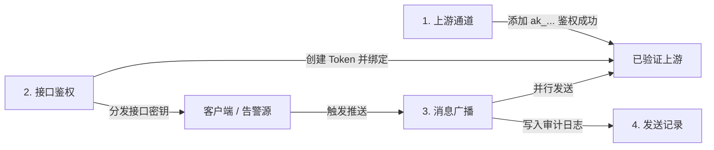

# CMCC New Message Webhook

面向中国移动 5G 新消息（OpenClaw 兼容通道）的消息推送网关，支持 Gotify 协议兼容与通用 Webhook 接入。内置现代化 Web 管理控制台、上游通道实时验活、多通道广播分发、AES-256-GCM 敏感数据落盘加密与 SQLite 发送记录审计。

---

## 核心特性

- **双接入协议**：
  - **Gotify 兼容**：支持 `POST /message?token=<token>`，可直接替换原有 Gotify 监控报警源。
  - **标准 Webhook**：支持 `POST /webhook`（Bearer Secret 鉴权），提供标准化 JSON 消息载荷。
- **多上游通道与广播分发**：
  - 支持配置多个中国移动通道（API Key，如 `ak_...`）。
  - 新增通道时执行真实 WebSocket `auth` 握手校验，未通过鉴权严禁保存。
  - 一个接口凭据可绑定多个上游通道，接收到通知后并行广播推送。
- **完善的消息格式与富媒体支持**：
  - **纯文本**：Markdown 格式智能清洗转换，长文本按 2000 字符结合段落语意自动切片。
  - **富媒体**：支持 `IMAGE`、`AUDIO`、`VIDEO`、`FILE`、`TEXT` 5 种媒体类型。
  - **媒体说明文字保真**：带说明文字的富媒体自动拆分为“独立文本消息 + 媒体消息”，防止移动终端忽略文案。
  - **双通道媒体提交**：支持远程媒体 URL，或在后台直接上传最大 200MB 的本地媒体文件（自动上传至中国移动文件网关）。
- **生产级安全防护**：
  - **数据落盘加密**：上游 API Key 与接口密钥均经 AES-256-GCM 加密后存入 SQLite，前台仅展示脱敏预览。
  - **防暴力破解**：管理员登录 15 分钟内连续失败 5 次，自动封禁该 IP 30 分钟（HTTP 429）。
  - **SSRF 防御**：严格拦截针对内网、私有 IP 及 Localhost 的恶意远程媒体请求。
  - **安全会话与审计**：8 小时 HttpOnly + SameSite=Strict 会话 Cookie，Fastify 日志自动屏蔽鉴权密钥。
- **开箱即用的可视化控制台**：
  - 仪表盘统计（已验证通道数、凭据数、当前投递成功/失败统计）。
  - 上游通道与接口凭据生命周期管理（创建、多选绑定、单次明文复制、删除）。
  - 手动推送测试（支持纯文本、富媒体 URL、本地文件上传直推）。
  - 投递历史明细追踪（状态、通道、摘要、MessageId、失败原因）。

---

## 快速开始

### 环境要求

- Node.js >= 22.0.0（内置原生 `node:sqlite` 支持）
- npm >= 10.0.0

### 方式一：本地部署

1. **安装依赖与配置环境**：
   ```bash
   npm install
   cp .env.example .env
   # Windows PowerShell: Copy-Item .env.example .env
   ```
2. **编辑 `.env` 文件**（设置管理员账号及加密密钥）：
   ```env
   ADMIN_USERNAME=admin
   ADMIN_PASSWORD=your-secure-password
   CONFIG_ENCRYPTION_KEY=your-random-32-chars-key
   ```
3. **编译并启动服务**：
   ```bash
   # 编译 TypeScript
   npm run build

   # 生产启动
   npm start

   # 或开发调试模式
   npm run dev
   ```

### 方式二：Docker 容器化部署

#### 1. 使用 Docker Compose（推荐）

```bash
# 启动服务
docker compose up -d

# 查看运行状态与日志
docker compose logs -f
```

#### 2. 直接使用 Docker 运行

```bash
# 构建镜像
docker build -t cmcc-newmsg-webhook .

# 启动容器并挂载数据卷
docker run -d \
  --name cmcc-webhook \
  -p 3000:3000 \
  -v $(pwd)/data:/app/data \
  --env-file .env \
  --restart unless-stopped \
  cmcc-newmsg-webhook
```

启动成功后，浏览器访问 `http://localhost:3000/` 登录管理控制台。

---

## 环境变量配置

| 变量名 | 必填 | 默认值 | 说明 |
| :--- | :---: | :--- | :--- |
| `ADMIN_USERNAME` | **是** | - | 管理后台登录用户名 |
| `ADMIN_PASSWORD` | **是** | - | 管理后台登录密码 |
| `CONFIG_ENCRYPTION_KEY` | **是** | - | 用于 AES-256-GCM 加密存储密钥的随机字符串（丢失无法恢复数据） |
| `PORT` | 否 | `3000` | HTTP 服务监听端口 |
| `HOST` | 否 | `0.0.0.0` | HTTP 服务监听地址 |
| `ADMIN_COOKIE_SECURE` | 否 | `false` | 生产环境启用 HTTPS 代理时应设为 `true` |
| `CMCC_DATABASE_PATH` | 否 | `./data/cmcc-webhook.sqlite` | SQLite 数据库文件存储路径 |
| `CMCC_WS_URL` | 否 | `wss://5gvas01.cmicmaap.com/gtw-ai/openclaw/ws/msg` | 中国移动新消息 WebSocket 网关地址 |
| `CMCC_WS_VERSION` | 否 | `2.0` | 中国移动新消息通道协议版本 |
| `CMCC_SEND_TIMEOUT_MS` | 否 | `10000` | 消息投递超时时间（毫秒，1000~120000） |
| `CMCC_UPLOAD_URL` | 否 | `https://5gvas01.cmicmaap.com/gtw-ai/openclaw/api` | 中国移动媒体文件上传 API 网关基地址 |
| `CMCC_UPLOAD_TIMEOUT_MS` | 否 | `120000` | 媒体文件上传超时时间（毫秒，1000~600000） |
| `ADMIN_LOGIN_FAIL_LIMIT` | 否 | `5` | 登录触发封禁的最大连续失败尝试次数 |
| `ADMIN_LOGIN_FAIL_WINDOW_MIN` | 否 | `15` | 登录失败统计观测窗口（分钟） |
| `ADMIN_LOGIN_BAN_DURATION_MIN` | 否 | `30` | 登录封禁限制时长（分钟） |

---

## 控制台使用流程



1. **配置上游通道**：在“上游通道”页面输入通道名称与移动端 `ak_...` API Key。系统会立即发起 WebSocket 握手校验，仅在收到 `auth_ok` 后落盘保存。
2. **生成接口凭据**：在“接口鉴权”选择创建 `Gotify Token` 或 `Webhook Bearer Secret`，勾选绑定的一个或多个上游通道。**新密钥仅在弹窗中明文展示一次**，请及时妥善保存。
3. **手动推送测试**：在“手动推送”选择目标上游，可即时测试文本发送、远程富媒体 URL 解析或拖拽上传最大 200MB 的本地媒体文件。
4. **审计投递状态**：在“发送记录”中实时查看所有推送的投递详情、MessageId 以及多通道失败回执。

---

## 接口规范

### 1. 健康检查

- **请求**：`GET /healthz`
- **鉴权保护**：为防止公网嗅探与探测，健康检查接口受鉴权保护。请求必须携带系统任一有效凭据，未鉴权或凭据无效直接返回 `404 Not Found`：
  - **管理员登录 Cookie**
  - **Gotify Token**：通过 URL 参数 `?token=<gotify-token>` 或请求头 `X-Gotify-Key: <gotify-token>`
  - **Webhook Secret**：通过请求头 `Authorization: Bearer <webhook-secret>`
- **响应**：`{"ok": true}`（HTTP 200）

```bash
# 使用 Gotify Token 检查
curl -i http://localhost:3000/healthz?token=<gotify-token>

# 使用 Webhook Secret 检查
curl -i http://localhost:3000/healthz -H 'Authorization: Bearer <webhook-secret>'
```

### 2. Gotify 兼容接口

- **路径**：`POST /message?token=<gotify-token>` 或使用请求头 `X-Gotify-Key: <gotify-token>`

#### 普通文本消息

```bash
curl -X POST 'http://localhost:3000/message?token=<gotify-token>' \
  -H 'Content-Type: application/json' \
  -d '{
    "title": "服务器告警",
    "message": "CPU 使用率已超过 90%",
    "priority": 5
  }'
```

#### 富媒体扩展消息（远程媒体 URL）

通过 `extras["cmcc-newmsg"]` 传递富媒体参数：

```bash
curl -X POST 'http://localhost:3000/message?token=<gotify-token>' \
  -H 'Content-Type: application/json' \
  -d '{
    "title": "监控快照",
    "message": "服务器机房实时监控",
    "extras": {
      "cmcc-newmsg": {
        "mediaType": "IMAGE",
        "mediaUrl": "https://example.com/snapshot.jpg",
        "thumbnailUrl": "https://example.com/snapshot_thumb.jpg"
      }
    }
  }'
```

#### 上传并发送本地文件（Multipart Form）

使用 `multipart/form-data` 直接上传本地媒体或文件（支持最大 200MB），服务端将自动转存送审并完成 5G 消息投递：

```bash
# 发送本地图片/视频/音频/文件
curl -X POST 'http://localhost:3000/message?token=<gotify-token>' \
  -F 'file=@./report.pdf' \
  -F 'title=运维报告' \
  -F 'message=请查阅本周运维报告附件'
```

- **表单字段说明**：
  - `file`：本地文件路径（必填）。
  - `title`：消息标题（可选）。
  - `message`：文本消息内容（可选；若携带文本，系统将先发送文本再发送文件）。
  - `mediaType`：媒体类型（可选，支持 `IMAGE`、`AUDIO`、`VIDEO`、`FILE`。未指定时系统自动根据文件扩展名/MIME 推断）。
  - `priority`：优先级（可选数字，如 5）。

### 3. 通用 Webhook 接口

- **路径**：`POST /webhook`
- **请求头**：`Authorization: Bearer <webhook-secret>`

#### 发送纯文本

```bash
curl -X POST http://localhost:3000/webhook \
  -H 'Authorization: Bearer <webhook-secret>' \
  -H 'Content-Type: application/json' \
  -d '{
    "type": "send",
    "content": "这是一条标准 Webhook 通知"
  }'
```

#### 发送远程富媒体

```bash
curl -X POST http://localhost:3000/webhook \
  -H 'Authorization: Bearer <webhook-secret>' \
  -H 'Content-Type: application/json' \
  -d '{
    "type": "send",
    "content": "项目交付物归档文件",
    "mediaType": "FILE",
    "mediaUrl": "https://example.com/release-v1.0.zip",
    "mediaFileName": "release-v1.0.zip"
  }'
```

#### 上传并发送本地文件（Multipart Form）

使用 `multipart/form-data` 上传本地文件，自动中转并推送到绑定的 5G 消息通道：

```bash
# 上传并发送本地文件
curl -X POST http://localhost:3000/webhook \
  -H 'Authorization: Bearer <webhook-secret>' \
  -F 'file=@./snapshot.png' \
  -F 'content=服务监控快照截图' \
  -F 'mediaType=IMAGE'
```

- **表单字段说明**：
  - `file`：本地文件路径（必填）。
  - `content` 或 `message`：文本说明内容（可选）。
  - `mediaType`：媒体类型（可选，支持 `IMAGE`、`AUDIO`、`VIDEO`、`FILE`，未传时自动根据文件后缀推断）。

> **分发规则与状态码**：
> - 接口凭据绑定多个上游时，请求将并行推送到所有已绑定的通道。
> - 全部投递成功返回 `200 OK`。
> - 存在任意上游投递失败时，返回 `502 Bad Gateway` 并附带各上游投递详情（`results`）。

---

## 协议与底层实现细节

- **WebSocket 握手机制**：连接建立时在 Header 携带 `X-API-Key`，打开连接后立即发送 `{"type":"auth","apiKey":"...","version":"2.0"}`。内置 15 秒心跳保活（`ping`/`pong`）与指数退避断线重连。
- **富媒体两阶段分发**：对于同时携带文案与媒体的推送，系统会先派发独立文本报文，随后派发媒体报文，避免终端展示层丢失正文说明。
- **本地文件流式上传**：后台上传文件时，使用 Multipart Form 流式转发至中国移动上传网关（字段：`file` 与 `apiKey`），接口投递完成后立即清除本地临时文件。

---

## 项目测试

执行内置 Vitest 自动化单元与集成测试：

```bash
npm test
```
